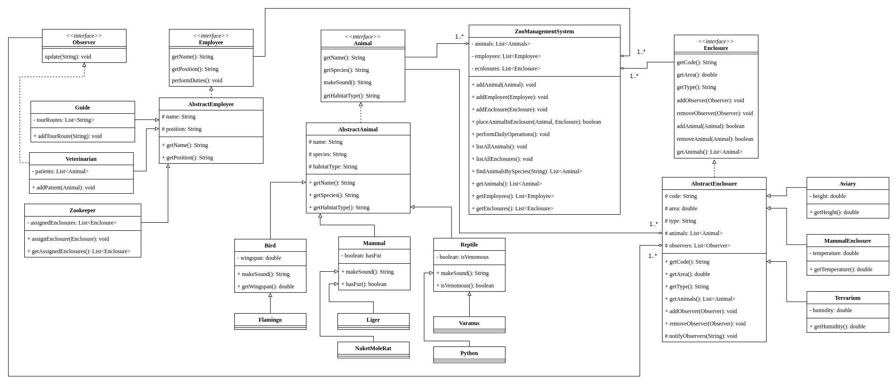

# Система управления зоопарком

Проект представляет собой программный комплекс на языке __Java__ для автоматизации учета животных, сотрудников и вольеров в зоопарке. Система спроектирована с использованием __принципов объектно-ориентированного программирования SOLID__.

Диаграмма классов системы:

## Архитектурные решения

### 1) Single Responsibility Principle (Принцип единственной ответственности)

Каждый класс имеет __одну ответственность__:

- `Animal`/`Employee`/`Enclosure`/`Observer` - интерфейсы, описывающие конкретное поведение

- `AbstractAnimal`/`AbstractEmployee`/`AbstractEnclosure` - абстрактные классы с четкими обязанностями

- Базовые классы животных `Mammal`/`Bird`/`Reptile` описывают четкое поведение

- Конкретные классы животных `Flamingo`/`Liger`/`NakedMoleRat`/`Python`/`Varanus` описывают конкретные виды и поведение

- Конкретные классы работников `Guide`/`Veterinarian`/`Zookeeper` описывают конкретные должности и выполнение специфических профессиональных обязанностей

- Конкретные классы вольеров `Aviary`/`MammalEnclosure`/`Terrarium` описывают конкретные вольеры и содержание животных и управление средой обитания

- `ZooManagementSystem` - основной класс работы с системой

### 2) Open/Closed Principle (Принцип открытости/закрытости)

Система __открыта для расширения__, но __закрыта для модификации__:

- Чтобы добавить новый вид животного, необходимо создать новый класс-наследник от `AbstractAnimal` (например, `Elephant`, `Dolphin`)
- Чтобы добавить новый тип работника, необходимо создать новый класс-наследник от `AbstractEmployee` (например, `Photographer`, `Cashier`)
- Чтобы добавить новый тип вольера, необходимо создать новый класс-наследник от `AbstractEnclosure` (например, `Pool`)

Для этого __не требуется__ изменять существующие классы.

### 3) Liskov Substitution Principle (Принцип подстановки Барбары Лисков)

Все __подклассы__ могут использоваться вместо своих __базовых типов__:

- Любое животное (`Liger`, `Varanus`, `Flamingo`) может быть использовано везде, где ожидается `Animal`

- Любой сотрудник (`Zookeeper`, `Veterinarian`, `Guide`) может быть использован как `Employee`

- Метод `performDailyOperations()` работает с абстракцией `Employee`, корректно вызывая специфичные реализации

- Метод `placeAnimalInEnclosure()` работает с абстракцией `Animal`, обеспечивая полиморфное поведение

### 4) Interface Segregation Principle (Принцип разделения интерфейсов)

Вместо __универсальных__ интерфейсов созданы __специализированные__:

- `Animal` - только методы, связанные с __животными__

- `Employee` - только методы, связанные с __сотрудниками__

- `Enclosure` - только методы управления __вольерами__

- `Observer` - отдельный интерфейс для паттерна __Наблюдатель__

Данный принцип избавляет классы от необходимости реализовывать неиспользуемые методы. Например, `Veterinarian` реализует `Observer`, но `Zookeeper` и `Guide` - нет.

### 5) Dependency Inversion Principle (Принцип инверсии зависимостей)

Классы __верхних уровней__ не зависят от классов __нижних уровней__, а зависят от __абстракций__:

- `ZooManagementSystem` работает с интерфейсами `Animal`, `Employee`, `Enclosure`

- `AbstractEnclosure` зависит от интерфейса `Observer`, а не конкретных реализаций

`Main` класс создает зависимости, но система спроектирована для легкого внедрения __DI контейнера__

## Преимущества текущей архитектуры
Методы `zoo.addAnimal(Animal animal)`/`zoo.addEnclosure(Enclosure enclosure)`/`zoo.addEmployee(Employee employee)` могут принимать любой объект, удовлетворяющий интерфейсам `Animal`/`Enclosure`/`Employee` соответственно

Разделение интерфейсов `Animal`/`Enclosure`/`Employee`/`Observer` гарантирует правильное распределение прав доступа к методам управления

## Проблемы при расширении проекта

### 1) Дублирование кода в классах

В текущей реализации существует проблема дублирования кода в классах животных. Для решения данной проблемы в следующей реализации можно использовать паттерны `Fabric` или `Builder`

### 2) Ограничение хранения данных

В текущей реализации данные в списках хранятся в оперативной памяти. При перезапуске программы происходит потеря данных. Существует ограничение на количество объектов. Для решения данной проблемы можно использовать `JPA`

### 3) Отсутствие DI контейнера

В текущей реализации присутствуют жесткие зависимости в методе `main`. Однако это усложняет тестирование и замену реализацийю. Для решения данной проблемы можно использовать `DI контенеры`

### 4) Ограниченная система уведомлений

В текущей реализации только `Veterinarian` получает уведомления. Отсутствуют разные типы событий, приоритеты событий. Для решения данной проблемы можно использовать `Event-driven архитектуру`
